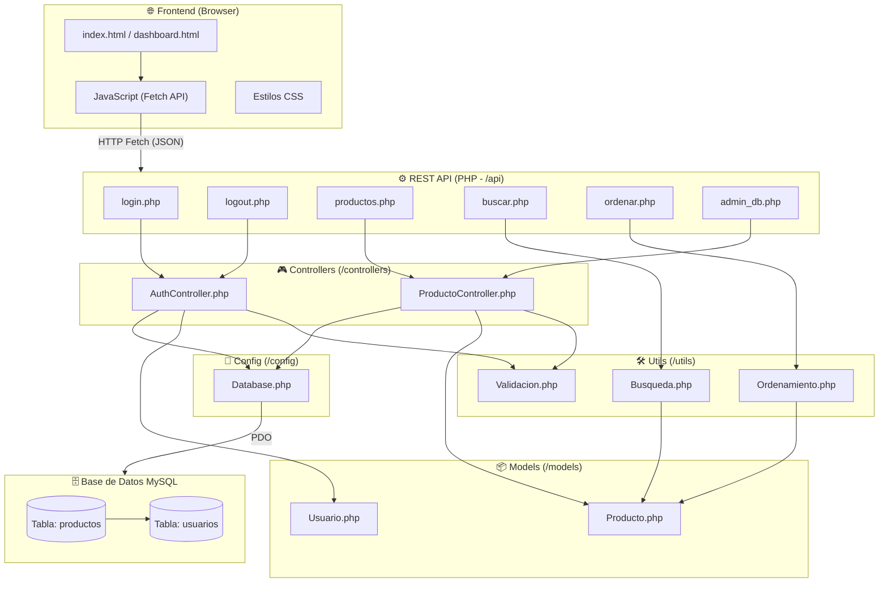
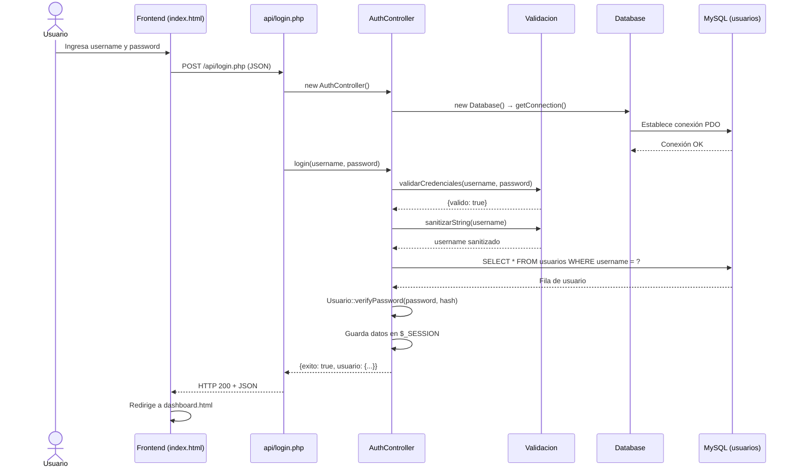
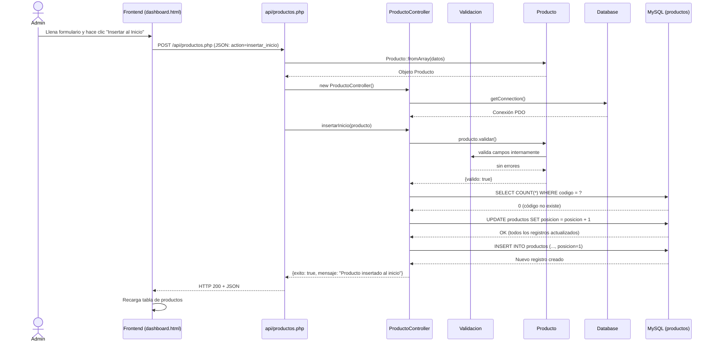
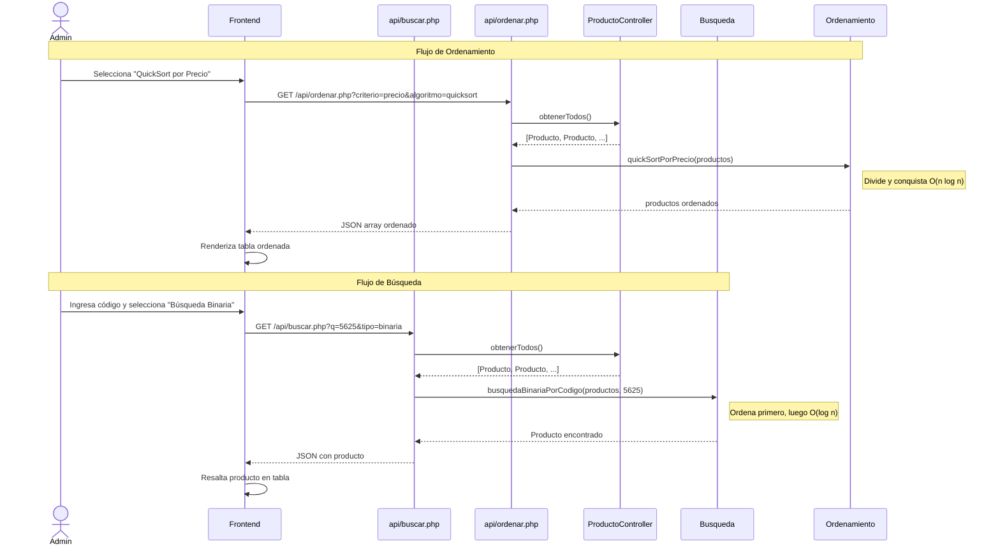
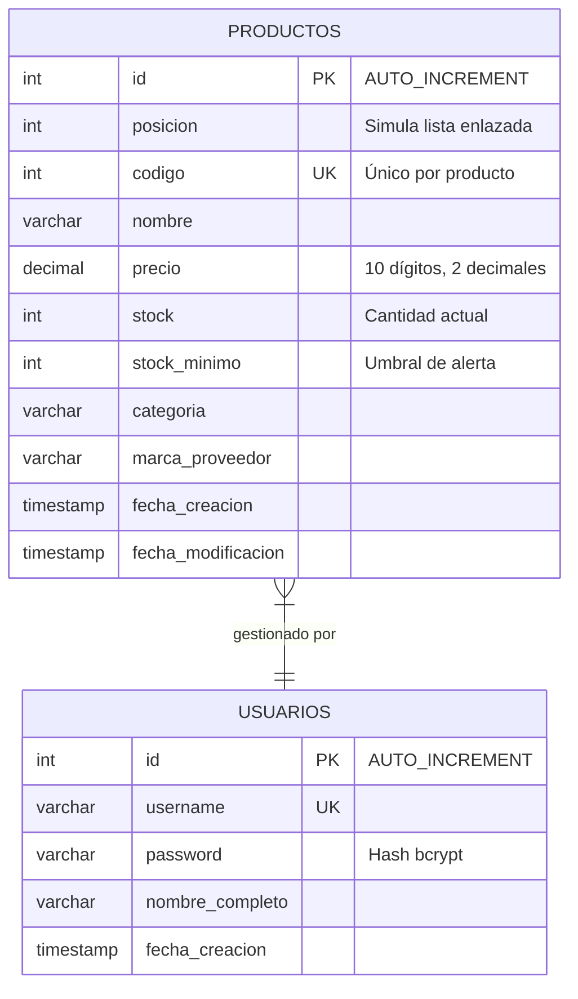
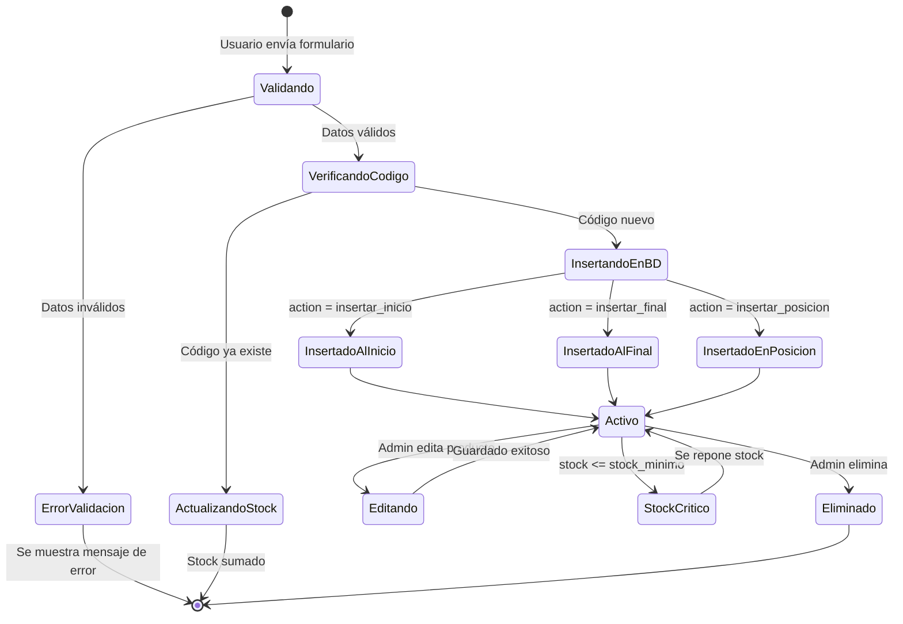
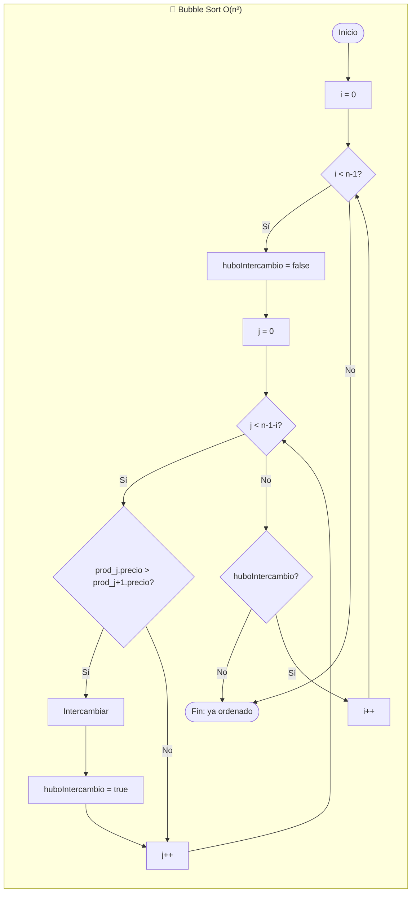
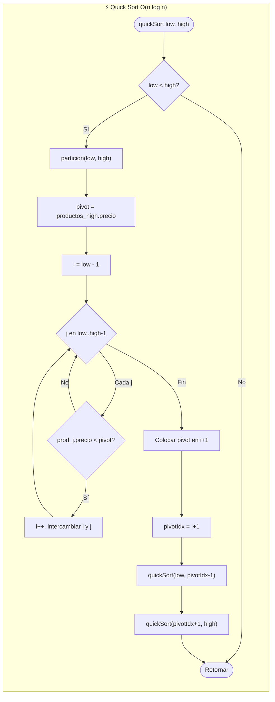
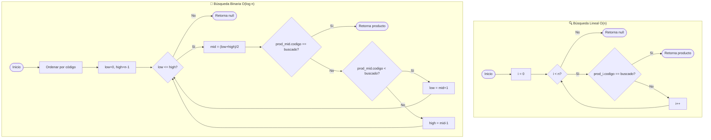

```mermaid
classDiagram
    %% ══════════════════════════════════════════════════════════════
    %% CAPA DE CONFIGURACIÓN
    %% ══════════════════════════════════════════════════════════════
    class Database {
        <<config>>
        -host : string
        -db_name : string
        -username : string
        -password : string
        -charset : string
        -conn : PDO
        +getConnection() PDO
        +closeConnection() void
        +beginTransaction() bool
        +commit() bool
        +rollback() bool
    }

    %% ══════════════════════════════════════════════════════════════
    %% CAPA DE MODELOS (entidades del dominio)
    %% ══════════════════════════════════════════════════════════════
    class Producto {
        <<model>>
        +id : int
        +posicion : int
        +codigo : int
        +nombre : string
        +precio : float
        +stock : int
        +stock_minimo : int
        +categoria : string
        +marca_proveedor : string
        +fecha_creacion : string
        +fecha_modificacion : string
        +__construct(codigo:int, nombre:string, precio:float, stock:int, stock_minimo:int, categoria:string, marca_proveedor:string, id:int) void
        +toArray() array
        +toJSON() string
        +validar() array
        +fromArray(data:array)$ Producto
    }

    class Usuario {
        <<model>>
        +id : int
        +username : string
        +password : string
        +nombre_completo : string
        +fecha_creacion : string
        +__construct(username:string, password:string, nombre_completo:string, id:int) void
        +toArray(includePassword:bool) array
        +validar() array
        +hashPassword(password:string)$ string
        +verifyPassword(password:string, hash:string)$ bool
        +fromArray(data:array)$ Usuario
    }

    %% ══════════════════════════════════════════════════════════════
    %% CAPA DE CONTROLADORES (lógica de negocio)
    %% ══════════════════════════════════════════════════════════════
    class ProductoController {
        <<controller>>
        -db : Database
        -conn : PDO
        +__construct() void
        +insertarInicio(producto:Producto) array
        +insertarFinal(producto:Producto) array
        +insertarPosicion(producto:Producto, posicion:int) array
        +eliminarInicio() array
        +eliminarFinal() array
        +eliminarPorCodigo(codigo:int) array
        +obtenerTodos() array
        +actualizarProducto(producto:Producto, codigoOriginal:int) array
        +contarProductos() int
        -codigoExiste(codigo:int) bool
        -registrarLog(accion:string, descripcion:string) void
    }

    class AuthController {
        <<controller>>
        -db : Database
        -conn : PDO
        +__construct() void
        +login(username:string, password:string) array
        +logout() array
        +verificarSesion() bool
        +obtenerUsuarioId() int
        -registrarLog(usuarioId:int, accion:string, descripcion:string) void
    }

    %% ══════════════════════════════════════════════════════════════
    %% CAPA DE UTILIDADES (algoritmos estáticos)
    %% ══════════════════════════════════════════════════════════════
    class Ordenamiento {
        <<utility>>
        +bubbleSortPorPrecio(productos:array)$ array
        +bubbleSortPorNombre(productos:array)$ array
        +quickSortPorPrecio(productos:array, low:int, high:int)$ array
        +quickSortPorNombre(productos:array, low:int, high:int)$ array
        +quickSortPorStock(productos:array, low:int, high:int)$ array
        -particionPrecio(arr:array, low:int, high:int)$ int
        -particionNombre(arr:array, low:int, high:int)$ int
        -particionStock(arr:array, low:int, high:int)$ int
    }

    class Busqueda {
        <<utility>>
        +busquedaLinealPorCodigo(productos:array, codigo:int)$ Producto
        +busquedaLinealPorNombre(productos:array, nombre:string)$ Producto
        +busquedaBinariaPorCodigo(productos:array, codigo:int)$ Producto
        +busquedaBinariaPorNombre(productos:array, nombre:string)$ Producto
        -ordenarPorCodigo(productos:array)$ array
        -ordenarPorNombre(productos:array)$ array
    }

    class Validacion {
        <<utility>>
        +esEntero(valor:mixed)$ bool
        +esFlotante(valor:mixed)$ bool
        +esStringValido(valor:mixed)$ bool
        +sanitizarString(valor:string)$ string
        +sanitizarEntero(valor:mixed)$ int
        +sanitizarFlotante(valor:mixed)$ float
        +validarProducto(datos:array)$ array
        +validarCredenciales(username:string, password:string)$ array
    }

    %% ══════════════════════════════════════════════════════════════
    %% RELACIONES ENTRE CLASES
    %% ══════════════════════════════════════════════════════════════
    ProductoController --> Database : usa (asociación)
    ProductoController --> Producto : gestiona (asociación)
    ProductoController --> Validacion : valida con (dependencia)
    AuthController --> Database : usa (asociación)
    AuthController --> Usuario : autentica (asociación)
    AuthController --> Validacion : valida con (dependencia)
    Busqueda --> Producto : retorna (dependencia)
    Ordenamiento --> Producto : ordena (dependencia)
```

# 📦 Sistema de Inventario HA&KU — Diseño UML

> Documentación técnica completa de la arquitectura del sistema, incluyendo diagramas de clases, secuencia, componentes, base de datos y flujo de datos.

---

## 1. Diagrama de Clases (Class Diagram)

El diagrama de clases muestra todas las clases del sistema con **notación UML formal**: visibilidad, tipos de datos, parámetros y métodos estáticos.

### 🔑 Leyenda de Notación UML

| Símbolo | Significado | En PHP |
|---|---|---|
| `+` | **público** `public` | Accesible desde cualquier clase |
| `-` | **privado** `private` | Solo accesible dentro de la misma clase |
| `#` | **protegido** `protected` | Accesible desde la clase y sus subclases |
| `$` al final | **estático** `static` | Se llama con `Clase::metodo()`, sin instancia |
| `tipo` después de `:` | **tipo del atributo** | `int`, `string`, `float`, `bool`, `array`, etc. |
| `tipo` al final del método | **tipo de retorno** | Lo que devuelve la función |

---



---

### 📋 Detalle completo de atributos y métodos por clase

#### 🔧 `Database` — Capa de Configuración

| Miembro | Visibilidad | Tipo | Descripción |
|---|---|---|---|
| `$host` | **private** `-` | `string` | Servidor MySQL (`localhost`) |
| `$db_name` | **private** `-` | `string` | Nombre de la BD (`inventario_db`) |
| `$username` | **private** `-` | `string` | Usuario de MySQL (`root`) |
| `$password` | **private** `-` | `string` | Contraseña de MySQL (vacía en XAMPP) |
| `$charset` | **private** `-` | `string` | Codificación (`utf8mb4`) |
| `$conn` | **private** `-` | `PDO` | Instancia activa de la conexión |
| `getConnection()` | **public** `+` | → `PDO` | Devuelve la conexión; la crea si no existe |
| `closeConnection()` | **public** `+` | → `void` | Cierra la conexión (asigna `null` a `$conn`) |
| `beginTransaction()` | **public** `+` | → `bool` | Inicia transacción en la BD |
| `commit()` | **public** `+` | → `bool` | Confirma los cambios de la transacción |
| `rollback()` | **public** `+` | → `bool` | Revierte los cambios de la transacción |

---

#### 📦 `Producto` — Modelo de Dominio

| Miembro | Visibilidad | Tipo | Descripción |
|---|---|---|---|
| `$id` | **public** `+` | `int` | PK auto-increment de la BD |
| `$posicion` | **public** `+` | `int` | Simula índice en la lista enlazada |
| `$codigo` | **public** `+` | `int` | Código único de negocio (UNIQUE en BD) |
| `$nombre` | **public** `+` | `string` | Nombre del producto |
| `$precio` | **public** `+` | `float` | Precio unitario (decimal 10,2) |
| `$stock` | **public** `+` | `int` | Cantidad disponible en inventario |
| `$stock_minimo` | **public** `+` | `int` | Umbral de alerta de stock bajo |
| `$categoria` | **public** `+` | `string` | Categoría del producto |
| `$marca_proveedor` | **public** `+` | `string` | Marca o proveedor del producto |
| `$fecha_creacion` | **public** `+` | `string` | Timestamp de creación (auto por MySQL) |
| `$fecha_modificacion` | **public** `+` | `string` | Timestamp de última edición (auto) |
| `__construct(...)` | **public** `+` | → `void` | Constructor con todos los campos opcionales |
| `toArray()` | **public** `+` | → `array` | Convierte el objeto a array asociativo |
| `toJSON()` | **public** `+` | → `string` | Serializa el producto a JSON |
| `validar()` | **public** `+` | → `array` | Valida campos; retorna `{valido, errores[]}` |
| `fromArray($data)` | **public static** `+$` | → `Producto` | Factory: construye un Producto desde array |

---

#### 👤 `Usuario` — Modelo de Dominio

| Miembro | Visibilidad | Tipo | Descripción |
|---|---|---|---|
| `$id` | **public** `+` | `int` | PK auto-increment de la BD |
| `$username` | **public** `+` | `string` | Nombre de usuario (UNIQUE en BD) |
| `$password` | **public** `+` | `string` | Hash bcrypt de la contraseña |
| `$nombre_completo` | **public** `+` | `string` | Nombre real del usuario |
| `$fecha_creacion` | **public** `+` | `string` | Timestamp de registro |
| `__construct(...)` | **public** `+` | → `void` | Constructor con todos los campos opcionales |
| `toArray($includePassword)` | **public** `+` | → `array` | Exporta datos; el password es opcional |
| `validar()` | **public** `+` | → `array` | Valida campos; retorna `{valido, errores[]}` |
| `hashPassword($password)` | **public static** `+$` | → `string` | Genera hash bcrypt de la contraseña |
| `verifyPassword($pass, $hash)` | **public static** `+$` | → `bool` | Verifica contraseña contra su hash |
| `fromArray($data)` | **public static** `+$` | → `Usuario` | Factory: construye un Usuario desde array |

---

#### 🎮 `ProductoController` — Controlador CRUD

| Miembro | Visibilidad | Tipo | Descripción |
|---|---|---|---|
| `$db` | **private** `-` | `Database` | Instancia de la clase Database |
| `$conn` | **private** `-` | `PDO` | Conexión PDO activa |
| `__construct()` | **public** `+` | → `void` | Instancia `Database` y obtiene la conexión |
| `insertarInicio($producto)` | **public** `+` | → `array` | Inserta al inicio (simula `InsertarIn` C++) |
| `insertarFinal($producto)` | **public** `+` | → `array` | Inserta al final (simula `InsertarFin` C++) |
| `insertarPosicion($producto, $pos)` | **public** `+` | → `array` | Inserta en posición arbitraria |
| `eliminarInicio()` | **public** `+` | → `array` | Elimina el primer registro |
| `eliminarFinal()` | **public** `+` | → `array` | Elimina el último registro |
| `eliminarPorCodigo($codigo)` | **public** `+` | → `array` | Elimina por código de producto |
| `obtenerTodos()` | **public** `+` | → `array` | Retorna todos los productos ordenados por posición |
| `actualizarProducto($prod, $codOrig)` | **public** `+` | → `array` | Actualiza un producto existente |
| `contarProductos()` | **public** `+` | → `int` | Cuenta el total de productos (`COUNT(*)`) |
| `codigoExiste($codigo)` | **private** `-` | → `bool` | Verifica unicidad de código antes de insertar |
| `registrarLog($accion, $desc)` | **private** `-` | → `void` | Registra eventos internos (desactivado) |

---

#### 🔐 `AuthController` — Controlador de Autenticación

| Miembro | Visibilidad | Tipo | Descripción |
|---|---|---|---|
| `$db` | **private** `-` | `Database` | Instancia de la clase Database |
| `$conn` | **private** `-` | `PDO` | Conexión PDO activa |
| `__construct()` | **public** `+` | → `void` | Instancia `Database` e inicia sesión PHP |
| `login($username, $password)` | **public** `+` | → `array` | Autentica y guarda datos en `$_SESSION` |
| `logout()` | **public** `+` | → `array` | Destruye la sesión PHP |
| `verificarSesion()` | **public** `+` | → `bool` | Comprueba si hay sesión activa |
| `obtenerUsuarioId()` | **public** `+` | → `int` | Retorna el ID del usuario en sesión |
| `registrarLog($uid, $accion, $desc)` | **private** `-` | → `void` | Registra login/logout (desactivado) |

---

#### ⚡ `Ordenamiento` — Utilidad de Algoritmos de Ordenamiento

> Todos los métodos son **estáticos** (`static`). No se instancia la clase; se usa como `Ordenamiento::quickSortPorPrecio(...)`.

| Miembro | Visibilidad | Tipo retorno | Complejidad | Descripción |
|---|---|---|---|---|
| `bubbleSortPorPrecio(&$productos)` | **public static** `+$` | `array` | O(n²) / O(n) | Ordena por precio ascendente con Bubble Sort |
| `bubbleSortPorNombre(&$productos)` | **public static** `+$` | `array` | O(n²) | Ordena alfabéticamente por nombre |
| `quickSortPorPrecio(&$productos, $low, $high)` | **public static** `+$` | `array` | O(n log n) | Ordena por precio con QuickSort recursivo |
| `quickSortPorNombre(&$productos, $low, $high)` | **public static** `+$` | `array` | O(n log n) | Ordena por nombre con QuickSort recursivo |
| `quickSortPorStock(&$productos, $low, $high)` | **public static** `+$` | `array` | O(n log n) | Ordena por stock con QuickSort recursivo |
| `particionPrecio(&$arr, $low, $high)` | **private static** `-$` | `int` | O(n) | Auxiliar: partición por precio (pivote = último) |
| `particionNombre(&$arr, $low, $high)` | **private static** `-$` | `int` | O(n) | Auxiliar: partición por nombre |
| `particionStock(&$arr, $low, $high)` | **private static** `-$` | `int` | O(n) | Auxiliar: partición por stock |

---

#### 🔍 `Busqueda` — Utilidad de Algoritmos de Búsqueda

> Todos los métodos son **estáticos** (`static`).

| Miembro | Visibilidad | Tipo retorno | Complejidad | Descripción |
|---|---|---|---|---|
| `busquedaLinealPorCodigo($productos, $codigo)` | **public static** `+$` | `Producto\|null` | O(n) | Recorre el array secuencialmente buscando por código |
| `busquedaLinealPorNombre($productos, $nombre)` | **public static** `+$` | `Producto\|null` | O(n) | Recorre el array secuencialmente buscando por nombre |
| `busquedaBinariaPorCodigo($productos, $codigo)` | **public static** `+$` | `Producto\|null` | O(log n) | Divide el espacio de búsqueda a la mitad en cada paso |
| `busquedaBinariaPorNombre($productos, $nombre)` | **public static** `+$` | `Producto\|null` | O(log n) | Búsqueda binaria alfabética por nombre |
| `ordenarPorCodigo($productos)` | **private static** `-$` | `array` | O(n²) | Auxiliar: ordena por código antes de búsqueda binaria |
| `ordenarPorNombre($productos)` | **private static** `-$` | `array` | O(n²) | Auxiliar: ordena por nombre antes de búsqueda binaria |

---

#### ✅ `Validacion` — Utilidad de Validación y Sanitización

> Todos los métodos son **estáticos** (`static`).

| Miembro | Visibilidad | Tipo retorno | Descripción |
|---|---|---|---|
| `esEntero($valor)` | **public static** `+$` | `bool` | Verifica que el valor sea un entero válido (sin decimales) |
| `esFlotante($valor)` | **public static** `+$` | `bool` | Verifica que el valor sea un número (entero o decimal) |
| `esStringValido($valor)` | **public static** `+$` | `bool` | Verifica que sea un string no vacío |
| `sanitizarString($valor)` | **public static** `+$` | `string` | Aplica `trim`, `stripslashes` y `htmlspecialchars` |
| `sanitizarEntero($valor)` | **public static** `+$` | `int\|null` | Convierte a `int` si es válido, o retorna `null` |
| `sanitizarFlotante($valor)` | **public static** `+$` | `float\|null` | Convierte a `float` si es válido, o retorna `null` |
| `validarProducto($datos)` | **public static** `+$` | `array` | Valida y sanitiza todos los campos de un producto |
| `validarCredenciales($user, $pass)` | **public static** `+$` | `array` | Valida que username y password no estén vacíos |

---

### 📝 Explicación de las Relaciones de Clases

| Relación | Tipo | Descripción |
|---|---|---|
| `ProductoController` → `Database` | **Asociación** | El controlador instancia `Database` en su constructor para obtener la conexión PDO |
| `ProductoController` → `Producto` | **Asociación** | Recibe objetos `Producto` como parámetros y retorna colecciones de ellos |
| `ProductoController` → `Validacion` | **Dependencia** | Invoca métodos estáticos de `Validacion` antes de toda operación de escritura |
| `AuthController` → `Database` | **Asociación** | Idéntico al anterior pero para operaciones de usuario/sesión |
| `AuthController` → `Usuario` | **Asociación** | Crea objetos `Usuario` vía `fromArray()` tras consultar la BD |
| `Busqueda` → `Producto` | **Dependencia** | Opera sobre arrays de objetos `Producto` y retorna instancias de `Producto` |
| `Ordenamiento` → `Producto` | **Dependencia** | Reordena arrays de `Producto` accediendo a sus propiedades `precio`, `nombre`, `stock` |

---

## 2. Diagrama de Componentes (Component Diagram)

Muestra cómo las capas del sistema se organizan y comunican entre sí.



### 📝 Explicación de la Arquitectura por Capas

La arquitectura sigue el patrón **MVC (Model-View-Controller)** adaptado a PHP sin framework:

- **Frontend**: Páginas HTML estáticas que hacen peticiones HTTP asíncronas (Fetch API) al servidor. No hay renderizado del lado del servidor (SSR); toda la UI se actualiza en el navegador con JavaScript.
- **API REST (`/api`)**: Archivos PHP que actúan como puntos de entrada. Reciben peticiones en JSON, instancian los controladores correspondientes y devuelven respuestas en JSON.
- **Controllers (`/controllers`)**: Contienen la lógica de negocio. Orquestan la interacción entre los modelos, la base de datos y las utilidades.
- **Utils (`/utils`)**: Clases de apoyo con métodos estáticos. Implementan los algoritmos de ordenamiento, búsqueda y validación desde cero (sin funciones nativas de PHP).
- **Models (`/models`)**: Representan las entidades del dominio (Producto, Usuario). Son POPOs (Plain Old PHP Objects) sin lógica de acceso a datos.
- **Config (`/config`)**: Clase `Database` que encapsula la conexión PDO con MySQL, implementando el patrón de reutilización de conexión.

---

## 3. Diagrama de Secuencia — Flujo de Login

Muestra el flujo completo de autenticación de un usuario.



---

## 4. Diagrama de Secuencia — CRUD de Productos

Muestra el flujo completo para insertar un producto al inicio de la lista.



---

## 5. Diagrama de Secuencia — Búsqueda y Ordenamiento



---

## 6. Diagrama Entidad-Relación (ER) — Base de Datos



### 📝 Explicación del Esquema de Base de Datos

| Campo | Propósito |
|---|---|
| `posicion` | Campo clave que **simula el comportamiento de una lista enlazada**. Al insertar al inicio, todos los registros existen haren un `UPDATE posicion = posicion + 1`. Al insertar al final se usa `MAX(posicion) + 1` |
| `codigo` | Identificador de negocio (UNIQUE). Distinto del `id` auto-increment. Si se inserta un código existente, se suma el stock en lugar de duplicar |
| `stock_minimo` | Define el umbral mínimo de alerta visual en el dashboard |
| `password` | Almacenado con **hash bcrypt** vía `password_hash()`. Nunca en texto plano |

---

## 7. Diagrama de Estado — Ciclo de Vida de un Producto



---

## 8. Diagrama de Actividad — Algoritmos de Búsqueda y Ordenamiento

### Bubble Sort vs Quick Sort





### Búsqueda Lineal vs Búsqueda Binaria



---

## 9. Resumen de Complejidad Algoritmica

| Algoritmo | Mejor Caso | Caso Promedio | Peor Caso | Espacio | Notas |
|---|---|---|---|---|---|
| **Bubble Sort (precio/nombre)** | O(n) | O(n²) | O(n²) | O(1) | Optimizado con flag `huboIntercambio` |
| **Quick Sort (precio/nombre/stock)** | O(n log n) | O(n log n) | O(n²) | O(log n) | Peor caso muy raro; pivote = último elemento |
| **Búsqueda Lineal (código/nombre)** | O(1) | O(n) | O(n) | O(1) | Funciona con listas desordenadas |
| **Búsqueda Binaria (código/nombre)** | O(1) | O(log n) | O(log n) | O(1) | Requiere ordenar primero; `log₂(1,000,000) ≈ 20` ops |

---

## 10. Estructura de Archivos del Proyecto

```
Sistema_Inventario/
│
├── 📁 api/                         ← Endpoints REST (reciben JSON, responden JSON)
│   ├── login.php                   ← POST: autenticación de usuario
│   ├── logout.php                  ← POST: cierre de sesión
│   ├── productos.php               ← CRUD completo de productos
│   ├── buscar.php                  ← Búsqueda lineal y binaria
│   ├── ordenar.php                 ← Bubble Sort y Quick Sort
│   └── admin_db.php                ← Operaciones administrativas
│
├── 📁 controllers/                 ← Lógica de negocio (MVC Controller)
│   ├── AuthController.php          ← Login, logout, verificar sesión
│   └── ProductoController.php      ← CRUD + simulación lista enlazada
│
├── 📁 models/                      ← Entidades del dominio (MVC Model)
│   ├── Producto.php                ← Struct de producto con validación
│   └── Usuario.php                 ← Struct de usuario con hash bcrypt
│
├── 📁 utils/                       ← Algoritmos implementados desde cero
│   ├── Ordenamiento.php            ← BubbleSort + QuickSort
│   ├── Busqueda.php                ← Búsqueda Lineal + Binaria
│   └── Validacion.php              ← Validación y sanitización
│
├── 📁 config/
│   └── database.php                ← Conexión PDO a MySQL
│
├── 📁 public/                      ← Frontend (MVC View)
│   ├── index.html                  ← Página de login
│   ├── dashboard.html              ← Panel principal del inventario
│   ├── 📁 css/                     ← Estilos
│   └── 📁 js/                      ← Lógica de cliente (Fetch API)
│
├── inventario_db.sql               ← Esquema y datos iniciales de la BD
└── install.php                     ← Script de instalación automática
```

---

## 11. Patrones de Diseño Utilizados

| Patrón | Clase(s) | Descripción |
|---|---|---|
| **MVC** | Toda la arquitectura | Separación clara: Modelos (`/models`), Vistas (`/public`), Controladores (`/controllers`) |
| **Singleton implícito** | `Database` | La conexión PDO se reutiliza dentro de la misma petición (atributo `$conn` privado) |
| **Factory Method** | `Producto::fromArray()`, `Usuario::fromArray()` | Métodos estáticos que construyen objetos desde arrays asociativos (resultados de BD) |
| **DTO (Data Transfer Object)** | `Producto`, `Usuario` | Los modelos son contenedores de datos que se transfieren entre capas vía `toArray()` / `toJSON()` |
| **Repository (informal)** | `ProductoController` | Centraliza todas las consultas de acceso a datos de productos en un único controlador |
| **Simulación de Lista Enlazada** | `ProductoController` + campo `posicion` | El campo `posicion` en la BD imita el comportamiento de nodos en una lista enlazada (InsertarIn, InsertarFin, EliminarIn, EliminarFin) |
