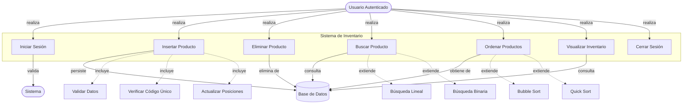
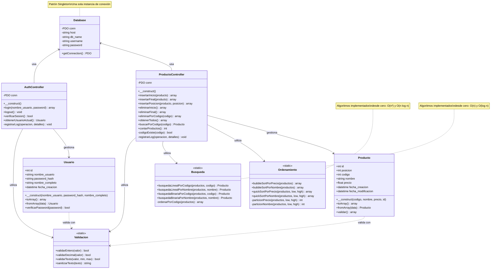
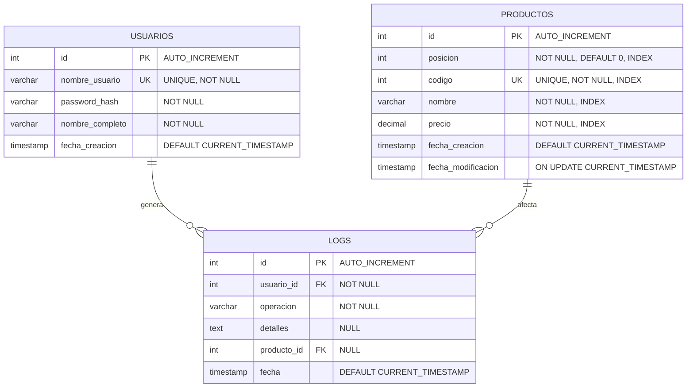

# 📐 Diseños del Sistema de Inventario

Este documento contiene los tres diseños principales del sistema: Casos de Uso, Diagrama UML de Clases, y Diseño de Base de Datos.

---

## 1. Diagrama de Casos de Uso

### Diagrama



### Explicación del Diagrama de Casos de Uso

#### Actores del Sistema

**1. Usuario Autenticado**
- **Descripción**: Persona que ha iniciado sesión en el sistema
- **Responsabilidades**: Gestionar el inventario de productos
- **Acciones**: Puede realizar todas las operaciones CRUD y consultas

**2. Sistema**
- **Descripción**: Componente que procesa la lógica de negocio
- **Responsabilidades**: Validar datos, ejecutar algoritmos, coordinar operaciones
- **Interacciones**: Intermediario entre usuario y base de datos

**3. Base de Datos**
- **Descripción**: Almacenamiento persistente de información
- **Responsabilidades**: Guardar, recuperar y eliminar datos
- **Tecnología**: MySQL

#### Casos de Uso Principales

##### UC1: Iniciar Sesión
- **Actor**: Usuario
- **Precondición**: Usuario tiene credenciales válidas
- **Flujo Principal**:
  1. Usuario ingresa nombre de usuario y NIP
  2. Sistema valida credenciales contra BD
  3. Sistema verifica hash de contraseña
  4. Sistema crea sesión
  5. Sistema redirige a dashboard
- **Postcondición**: Usuario autenticado con sesión activa
- **Excepciones**: Credenciales inválidas → Mostrar error

##### UC2: Insertar Producto
- **Actor**: Usuario Autenticado
- **Precondición**: Usuario tiene sesión activa
- **Flujo Principal**:
  1. Usuario ingresa código, nombre, precio
  2. Usuario selecciona tipo de inserción (inicio/final/posición)
  3. Sistema valida datos (UC2A)
  4. Sistema verifica código único (UC2B)
  5. Sistema actualiza posiciones si es necesario (UC2C)
  6. Sistema inserta producto en BD
  7. Sistema registra log de operación
  8. Sistema muestra confirmación
- **Postcondición**: Producto insertado en la posición correcta
- **Excepciones**: 
  - Código duplicado → Rechazar inserción
  - Datos inválidos → Mostrar errores de validación

**Casos de Uso Incluidos:**
- **UC2A: Validar Datos**
  - Verificar que código sea numérico
  - Verificar que nombre no esté vacío
  - Verificar que precio sea >= 0
  
- **UC2B: Verificar Código Único**
  - Consultar BD para verificar si código existe
  - Retornar error si ya existe
  
- **UC2C: Actualizar Posiciones**
  - Si inserción al inicio: incrementar posición de todos
  - Si inserción en posición específica: ajustar posiciones afectadas

##### UC3: Eliminar Producto
- **Actor**: Usuario Autenticado
- **Precondición**: Existen productos en el inventario
- **Flujo Principal**:
  1. Usuario selecciona tipo de eliminación (inicio/final/código)
  2. Sistema solicita confirmación
  3. Usuario confirma
  4. Sistema elimina producto de BD
  5. Sistema registra log
  6. Sistema actualiza vista
- **Postcondición**: Producto eliminado del inventario
- **Excepciones**: 
  - Inventario vacío → Mostrar mensaje
  - Código no existe → Mostrar error

##### UC4: Buscar Producto
- **Actor**: Usuario Autenticado
- **Precondición**: Usuario tiene sesión activa
- **Flujo Principal**:
  1. Usuario ingresa criterio de búsqueda (código o nombre)
  2. Usuario selecciona algoritmo (lineal o binaria)
  3. Sistema ejecuta búsqueda
  4. Sistema mide tiempo de ejecución
  5. Sistema muestra resultado y tiempo
- **Postcondición**: Producto encontrado o mensaje de no encontrado
- **Extensiones**:
  - **UC4A: Búsqueda Lineal** - O(n), funciona con datos desordenados
  - **UC4B: Búsqueda Binaria** - O(log n), requiere ordenamiento previo

##### UC5: Ordenar Productos
- **Actor**: Usuario Autenticado
- **Precondición**: Existen productos en el inventario
- **Flujo Principal**:
  1. Usuario selecciona criterio (precio, nombre, código)
  2. Usuario selecciona algoritmo (Bubble Sort o Quick Sort)
  3. Sistema ejecuta ordenamiento
  4. Sistema mide tiempo de ejecución
  5. Sistema muestra productos ordenados y tiempo
- **Postcondición**: Productos mostrados en orden especificado
- **Extensiones**:
  - **UC5A: Bubble Sort** - O(n²), simple pero lento
  - **UC5B: Quick Sort** - O(n log n), rápido para grandes volúmenes

##### UC6: Visualizar Inventario
- **Actor**: Usuario Autenticado
- **Precondición**: Usuario tiene sesión activa
- **Flujo Principal**:
  1. Sistema consulta productos ordenados por posición
  2. Sistema muestra tabla con todos los productos
  3. Sistema muestra contador total
- **Postcondición**: Usuario ve inventario completo

##### UC7: Cerrar Sesión
- **Actor**: Usuario Autenticado
- **Precondición**: Usuario tiene sesión activa
- **Flujo Principal**:
  1. Usuario hace clic en "Cerrar Sesión"
  2. Sistema destruye sesión
  3. Sistema redirige a página de login
- **Postcondición**: Sesión terminada

#### Relaciones entre Casos de Uso

**Include (Incluye)**: Relación obligatoria
- UC2 **incluye** UC2A, UC2B, UC2C
- Siempre se ejecutan como parte de insertar producto

**Extend (Extiende)**: Relación opcional
- UC4 **se extiende** a UC4A o UC4B
- UC5 **se extiende** a UC5A o UC5B
- El usuario elige cuál ejecutar

---

## 2. Diagrama UML de Clases

### Diagrama



### Explicación del Diagrama UML

#### Arquitectura General

El sistema sigue el patrón **MVC (Model-View-Controller)** con capas adicionales de utilidades:

```
┌─────────────────────────────────────────────────┐
│              CAPA DE VISTA                      │
│         (HTML/CSS/JavaScript)                   │
│         No aparece en UML backend               │
└────────────────┬────────────────────────────────┘
                 │ HTTP/JSON
┌────────────────▼────────────────────────────────┐
│         CAPA DE CONTROLADORES                   │
│    ProductoController | AuthController          │
└────────────────┬────────────────────────────────┘
                 │
    ┌────────────┼────────────┐
    │            │            │
┌───▼────┐  ┌───▼────┐  ┌───▼────────┐
│MODELOS │  │UTILIDAD│  │CONFIGURACIÓN│
│Producto│  │Ordenam.│  │  Database  │
│Usuario │  │Búsqueda│  └────────────┘
└────────┘  │Validac.│
            └────────┘
```

#### Capa de Configuración

##### Database
- **Patrón**: Singleton
- **Responsabilidad**: Gestionar conexión única a MySQL
- **Atributos**:
  - `conn`: Objeto PDO de conexión
  - `host`, `db_name`, `username`, `password`: Credenciales
- **Método Principal**:
  - `getConnection()`: Retorna conexión PDO reutilizable
- **¿Por qué Singleton?**
  - Evita múltiples conexiones innecesarias
  - Ahorra recursos del servidor
  - Punto centralizado de configuración

#### Capa de Modelos (Entidades)

##### Producto
- **Responsabilidad**: Representar un producto del inventario
- **Atributos**:
  - `id`: Identificador único auto-incremental
  - `posicion`: Posición en la lista (para ordenamiento)
  - `codigo`: Código único del producto (INT)
  - `nombre`: Nombre descriptivo
  - `precio`: Precio en formato decimal
  - `fecha_creacion`, `fecha_modificacion`: Timestamps
- **Métodos**:
  - `__construct()`: Inicializa producto
  - `toArray()`: Convierte a array para JSON
  - `fromArray()`: Crea objeto desde array de BD
  - `validar()`: Valida reglas de negocio
- **Validaciones**:
  - Código debe ser numérico
  - Nombre no puede estar vacío
  - Precio debe ser >= 0

##### Usuario
- **Responsabilidad**: Representar un usuario del sistema
- **Atributos**:
  - `id`: Identificador único
  - `nombre_usuario`: Username para login
  - `password_hash`: Contraseña hasheada con bcrypt
  - `nombre_completo`: Nombre real del usuario
  - `fecha_creacion`: Timestamp de registro
- **Métodos**:
  - `verificarPassword()`: Compara password con hash
  - `toArray()`, `fromArray()`: Conversión de datos
- **Seguridad**:
  - Nunca almacena password en texto plano
  - Usa `password_hash()` y `password_verify()`

#### Capa de Utilidades

##### Ordenamiento
- **Tipo**: Clase estática (no requiere instanciación)
- **Responsabilidad**: Algoritmos de ordenamiento desde cero
- **Métodos Públicos**:
  - `bubbleSortPorPrecio()`: O(n²) - Simple, lento
  - `bubbleSortPorNombre()`: O(n²) - Ordenamiento alfabético
  - `quickSortPorPrecio()`: O(n log n) - Rápido, recursivo
  - `quickSortPorNombre()`: O(n log n) - Alfabético rápido
- **Métodos Privados**:
  - `particionPrecio()`: Auxiliar para Quick Sort
  - `particionNombre()`: Auxiliar para Quick Sort
- **Características**:
  - No usa funciones nativas de PHP (`sort()`, `usort()`)
  - Implementación manual con bucles y comparaciones
  - Demuestra conocimiento de análisis de algoritmos

##### Busqueda
- **Tipo**: Clase estática
- **Responsabilidad**: Algoritmos de búsqueda desde cero
- **Métodos Públicos**:
  - `busquedaLinealPorCodigo()`: O(n) - Secuencial
  - `busquedaLinealPorNombre()`: O(n) - Por nombre
  - `busquedaBinariaPorCodigo()`: O(log n) - Divide y conquista
  - `busquedaBinariaPorNombre()`: O(log n) - Alfabética
- **Método Privado**:
  - `ordenarPorCodigo()`: Prepara array para búsqueda binaria
- **Características**:
  - No usa `array_search()` ni `in_array()`
  - Búsqueda binaria requiere array ordenado
  - Implementación manual completa

##### Validacion
- **Tipo**: Clase estática
- **Responsabilidad**: Validación y sanitización de datos
- **Métodos**:
  - `validarEntero()`: Verifica que sea número entero
  - `validarDecimal()`: Verifica que sea número decimal
  - `validarTexto()`: Verifica longitud y caracteres
  - `sanitizarTexto()`: Limpia entrada de usuario
- **Uso**: Prevenir inyección SQL y XSS

#### Capa de Controladores (Lógica de Negocio)

##### ProductoController
- **Responsabilidad**: Gestionar operaciones CRUD de productos
- **Atributo**:
  - `conn`: Conexión PDO de Database
- **Métodos de Inserción**:
  - `insertarInicio()`: Inserta en posición 1
  - `insertarFinal()`: Inserta en última posición
  - `insertarPosicion()`: Inserta en posición específica
- **Métodos de Eliminación**:
  - `eliminarInicio()`: Elimina primer producto
  - `eliminarFinal()`: Elimina último producto
  - `eliminarPorCodigo()`: Elimina por código específico
- **Métodos de Consulta**:
  - `obtenerTodos()`: Retorna todos ordenados por posición
  - `buscarPorCodigo()`: Busca un producto específico
  - `contarProductos()`: Cuenta total de productos
- **Métodos Privados**:
  - `codigoExiste()`: Verifica unicidad de código
  - `registrarLog()`: Auditoría de operaciones
- **Dependencias**:
  - Usa `Producto` para validación
  - Usa `Ordenamiento` para ordenar resultados
  - Usa `Busqueda` para búsquedas eficientes
  - Usa `Database` para persistencia

##### AuthController
- **Responsabilidad**: Gestionar autenticación y sesiones
- **Métodos Públicos**:
  - `login()`: Autentica usuario
  - `logout()`: Cierra sesión
  - `verificarSesion()`: Verifica si hay sesión activa
  - `obtenerUsuarioActual()`: Retorna usuario logueado
- **Método Privado**:
  - `registrarLog()`: Auditoría de accesos
- **Seguridad**:
  - Verifica hash de contraseñas
  - Gestiona sesiones PHP
  - Previene acceso no autorizado

#### Relaciones entre Clases

**Asociación (usa)**:
- `ProductoController` → `Database`: Obtiene conexión
- `AuthController` → `Database`: Obtiene conexión

**Dependencia (utiliza)**:
- `ProductoController` → `Ordenamiento`: Para ordenar productos
- `ProductoController` → `Busqueda`: Para buscar productos
- `ProductoController` → `Validacion`: Para validar datos
- `AuthController` → `Validacion`: Para validar credenciales

**Composición (gestiona)**:
- `ProductoController` → `Producto`: Crea y manipula productos
- `AuthController` → `Usuario`: Crea y manipula usuarios

**Realización (valida con)**:
- `Producto` → `Validacion`: Usa para validar sus atributos
- `Usuario` → `Validacion`: Usa para validar credenciales

#### Principios de Diseño Aplicados

**1. Single Responsibility Principle (SRP)**
- Cada clase tiene una única responsabilidad
- `Producto` solo representa datos
- `ProductoController` solo gestiona lógica de negocio
- `Ordenamiento` solo ordena

**2. Open/Closed Principle (OCP)**
- Clases abiertas para extensión, cerradas para modificación
- Fácil agregar nuevos algoritmos de ordenamiento
- Fácil agregar nuevos tipos de búsqueda

**3. Dependency Inversion Principle (DIP)**
- Controladores dependen de abstracciones (PDO)
- No dependen de implementaciones concretas de BD

**4. Don't Repeat Yourself (DRY)**
- Algoritmos centralizados en clases de utilidades
- Validación reutilizable
- Conexión única (Singleton)

---

## 3. Diseño de Base de Datos

### Diagrama Entidad-Relación



### Esquema SQL Completo

```sql
-- ============================================
-- Base de Datos: inventario_db
-- ============================================

CREATE DATABASE IF NOT EXISTS inventario_db
CHARACTER SET utf8mb4
COLLATE utf8mb4_unicode_ci;

USE inventario_db;

-- ============================================
-- Tabla: usuarios
-- ============================================
CREATE TABLE IF NOT EXISTS usuarios (
    id INT AUTO_INCREMENT PRIMARY KEY,
    nombre_usuario VARCHAR(50) NOT NULL UNIQUE,
    password_hash VARCHAR(255) NOT NULL,
    nombre_completo VARCHAR(100) NOT NULL,
    fecha_creacion TIMESTAMP DEFAULT CURRENT_TIMESTAMP,
    
    INDEX idx_nombre_usuario (nombre_usuario)
) ENGINE=InnoDB DEFAULT CHARSET=utf8mb4 COLLATE=utf8mb4_unicode_ci;

-- ============================================
-- Tabla: productos
-- ============================================
CREATE TABLE IF NOT EXISTS productos (
    id INT AUTO_INCREMENT PRIMARY KEY,
    posicion INT NOT NULL DEFAULT 0,
    codigo INT NOT NULL UNIQUE,
    nombre VARCHAR(100) NOT NULL,
    precio DECIMAL(10, 2) NOT NULL,
    fecha_creacion TIMESTAMP DEFAULT CURRENT_TIMESTAMP,
    fecha_modificacion TIMESTAMP DEFAULT CURRENT_TIMESTAMP ON UPDATE CURRENT_TIMESTAMP,
    
    INDEX idx_posicion (posicion),
    INDEX idx_codigo (codigo),
    INDEX idx_nombre (nombre),
    INDEX idx_precio (precio)
) ENGINE=InnoDB DEFAULT CHARSET=utf8mb4 COLLATE=utf8mb4_unicode_ci;

-- ============================================
-- Tabla: logs
-- ============================================
CREATE TABLE IF NOT EXISTS logs (
    id INT AUTO_INCREMENT PRIMARY KEY,
    usuario_id INT NOT NULL,
    operacion VARCHAR(50) NOT NULL,
    detalles TEXT,
    producto_id INT NULL,
    fecha TIMESTAMP DEFAULT CURRENT_TIMESTAMP,
    
    FOREIGN KEY (usuario_id) REFERENCES usuarios(id) ON DELETE CASCADE,
    FOREIGN KEY (producto_id) REFERENCES productos(id) ON DELETE SET NULL,
    
    INDEX idx_usuario_id (usuario_id),
    INDEX idx_fecha (fecha),
    INDEX idx_operacion (operacion)
) ENGINE=InnoDB DEFAULT CHARSET=utf8mb4 COLLATE=utf8mb4_unicode_ci;
```

### Explicación del Diseño de Base de Datos

#### Características Generales

**Motor de Almacenamiento**: InnoDB
- ✅ Soporta transacciones ACID
- ✅ Integridad referencial con FOREIGN KEYS
- ✅ Bloqueo a nivel de fila
- ✅ Recuperación ante fallos

**Charset**: utf8mb4
- ✅ Soporta emojis y caracteres especiales
- ✅ Compatibilidad internacional completa
- ✅ Estándar moderno de Unicode

**Collation**: utf8mb4_unicode_ci
- ✅ Comparaciones case-insensitive
- ✅ Ordenamiento correcto de caracteres especiales

#### Tabla: usuarios

**Propósito**: Almacenar información de autenticación

**Campos**:

| Campo | Tipo | Descripción |
|-------|------|-------------|
| `id` | INT AUTO_INCREMENT | Clave primaria única |
| `nombre_usuario` | VARCHAR(50) UNIQUE | Username para login, debe ser único |
| `password_hash` | VARCHAR(255) | Contraseña hasheada con bcrypt |
| `nombre_completo` | VARCHAR(100) | Nombre real del usuario |
| `fecha_creacion` | TIMESTAMP | Fecha de registro automática |

**Índices**:
- `PRIMARY KEY (id)`: Búsqueda rápida por ID
- `UNIQUE (nombre_usuario)`: Garantiza unicidad de usernames
- `INDEX (nombre_usuario)`: Optimiza búsquedas en login

**Seguridad**:
- Contraseñas hasheadas con `password_hash()` de PHP
- Nunca almacena passwords en texto plano
- Hash bcrypt con salt automático

**Ejemplo de Datos**:
```sql
INSERT INTO usuarios (nombre_usuario, password_hash, nombre_completo) VALUES
('Horacio', '$2y$10$...hash...', 'Horacio Martínez'),
('Omar', '$2y$10$...hash...', 'Omar López');
```

#### Tabla: productos

**Propósito**: Almacenar inventario de productos

**Campos**:

| Campo | Tipo | Descripción |
|-------|------|-------------|
| `id` | INT AUTO_INCREMENT | Clave primaria única |
| `posicion` | INT NOT NULL | Posición en la lista (para ordenamiento) |
| `codigo` | INT UNIQUE | Código único del producto |
| `nombre` | VARCHAR(100) | Nombre descriptivo |
| `precio` | DECIMAL(10,2) | Precio con 2 decimales |
| `fecha_creacion` | TIMESTAMP | Fecha de creación automática |
| `fecha_modificacion` | TIMESTAMP | Actualización automática |

**Campo Especial: `posicion`**
- **¿Por qué existe?**: Simula comportamiento de lista enlazada
- **Función**: Mantiene orden independiente del ID
- **Ventaja**: Permite inserción al inicio/final sin depender de ID auto-incremental
- **Ejemplo**:
  ```
  id | posicion | codigo | nombre
  5  | 1        | 105    | Webcam     ← Insertado al inicio
  1  | 2        | 101    | Laptop     ← Posición incrementada
  2  | 3        | 102    | Mouse      ← Posición incrementada
  ```

**Índices**:
- `PRIMARY KEY (id)`: Identificación única
- `UNIQUE (codigo)`: Garantiza códigos únicos
- `INDEX (posicion)`: Optimiza `ORDER BY posicion`
- `INDEX (codigo)`: Optimiza búsquedas por código
- `INDEX (nombre)`: Optimiza búsquedas por nombre
- `INDEX (precio)`: Optimiza ordenamiento por precio

**¿Por qué tantos índices?**
- Sistema realiza búsquedas frecuentes
- Ordenamiento es operación común
- Índices aceleran consultas SELECT
- Costo: Espacio adicional (aceptable para este volumen)

**Constraints**:
- `NOT NULL` en campos críticos
- `UNIQUE` en código para evitar duplicados
- `DEFAULT 0` en posicion para nuevos productos

**Timestamps Automáticos**:
- `fecha_creacion`: Se establece al insertar
- `fecha_modificacion`: Se actualiza automáticamente con `ON UPDATE CURRENT_TIMESTAMP`

#### Tabla: logs

**Propósito**: Auditoría de operaciones del sistema

**Campos**:

| Campo | Tipo | Descripción |
|-------|------|-------------|
| `id` | INT AUTO_INCREMENT | Clave primaria única |
| `usuario_id` | INT FK | Referencia a usuario que realizó la acción |
| `operacion` | VARCHAR(50) | Tipo de operación (INSERT_INICIO, DELETE_CODIGO, etc.) |
| `detalles` | TEXT | Información adicional en formato JSON o texto |
| `producto_id` | INT FK NULL | Referencia a producto afectado (si aplica) |
| `fecha` | TIMESTAMP | Momento exacto de la operación |

**Relaciones (Foreign Keys)**:

1. **`usuario_id` → `usuarios.id`**
   - `ON DELETE CASCADE`: Si se elimina usuario, se eliminan sus logs
   - Mantiene integridad referencial
   
2. **`producto_id` → `productos.id`**
   - `ON DELETE SET NULL`: Si se elimina producto, el log permanece pero producto_id = NULL
   - Preserva historial aunque producto ya no exista

**Índices**:
- `INDEX (usuario_id)`: Consultar logs por usuario
- `INDEX (fecha)`: Consultar logs por rango de fechas
- `INDEX (operacion)`: Filtrar por tipo de operación

**Tipos de Operaciones Registradas**:
- `LOGIN`: Inicio de sesión
- `LOGOUT`: Cierre de sesión
- `INSERT_INICIO`: Inserción al inicio
- `INSERT_FINAL`: Inserción al final
- `INSERT_POSICION`: Inserción en posición específica
- `DELETE_INICIO`: Eliminación del primero
- `DELETE_FINAL`: Eliminación del último
- `DELETE_CODIGO`: Eliminación por código

**Ejemplo de Log**:
```sql
INSERT INTO logs (usuario_id, operacion, detalles, producto_id) VALUES
(1, 'INSERT_INICIO', 'Producto: Laptop Dell, Precio: 15000', 5);
```

#### Relaciones entre Tablas

```
USUARIOS (1) ──────── (N) LOGS
   │
   └─ Un usuario puede generar múltiples logs
   
PRODUCTOS (1) ──────── (N) LOGS
   │
   └─ Un producto puede aparecer en múltiples logs
```

**Cardinalidad**:
- `USUARIOS` → `LOGS`: 1:N (Uno a Muchos)
- `PRODUCTOS` → `LOGS`: 1:N (Uno a Muchos)

#### Normalización

**Forma Normal Alcanzada**: 3FN (Tercera Forma Normal)

**1FN (Primera Forma Normal)**:
- ✅ Todos los atributos son atómicos
- ✅ No hay grupos repetitivos
- ✅ Cada campo contiene un solo valor

**2FN (Segunda Forma Normal)**:
- ✅ Cumple 1FN
- ✅ Todos los atributos no clave dependen completamente de la clave primaria
- ✅ No hay dependencias parciales

**3FN (Tercera Forma Normal)**:
- ✅ Cumple 2FN
- ✅ No hay dependencias transitivas
- ✅ Cada atributo no clave depende solo de la clave primaria

**Ventajas de la Normalización**:
- Elimina redundancia de datos
- Facilita actualizaciones
- Previene anomalías de inserción/actualización/eliminación
- Mejora integridad de datos

#### Estrategia de Índices

**Índices Primarios** (PRIMARY KEY):
- `usuarios.id`
- `productos.id`
- `logs.id`

**Índices Únicos** (UNIQUE):
- `usuarios.nombre_usuario`
- `productos.codigo`

**Índices Secundarios** (INDEX):
- `productos.posicion` → Para `ORDER BY posicion`
- `productos.nombre` → Para búsquedas por nombre
- `productos.precio` → Para ordenamiento por precio
- `logs.usuario_id` → Para consultas de auditoría
- `logs.fecha` → Para reportes por fecha
- `logs.operacion` → Para filtrar por tipo

**Análisis de Rendimiento**:
```sql
-- Sin índice en posicion: O(n log n) sort
SELECT * FROM productos ORDER BY posicion;

-- Con índice en posicion: O(n) scan del índice
SELECT * FROM productos ORDER BY posicion;
```

#### Consideraciones de Diseño

**1. ¿Por qué INT para código y no VARCHAR?**
- ✅ Más eficiente en búsquedas (comparación numérica)
- ✅ Menor espacio de almacenamiento
- ✅ Índices más pequeños y rápidos
- ✅ Compatibilidad con código C++ original
- ❌ Limitación: No soporta códigos alfanuméricos

**2. ¿Por qué DECIMAL(10,2) para precio?**
- ✅ Precisión exacta (no errores de redondeo como FLOAT)
- ✅ Estándar para valores monetarios
- ✅ 10 dígitos totales, 2 decimales
- ✅ Soporta precios hasta 99,999,999.99

**3. ¿Por qué InnoDB y no MyISAM?**
- ✅ Transacciones ACID
- ✅ Foreign Keys
- ✅ Recuperación ante fallos
- ✅ Mejor para aplicaciones modernas

**4. ¿Por qué ON DELETE CASCADE en logs?**
- Si se elimina un usuario, sus logs también se eliminan
- Mantiene consistencia
- Evita logs huérfanos

**5. ¿Por qué ON DELETE SET NULL en logs.producto_id?**
- Preserva historial de operaciones
- Aunque el producto ya no exista, el log indica que existió
- Útil para auditoría

---

## Resumen de Diseños

### Casos de Uso
- **7 casos de uso principales**
- **3 actores** (Usuario, Sistema, BD)
- **Relaciones include y extend**
- **Flujos detallados** para cada caso

### UML de Clases
- **11 clases** en 4 capas
- **Patrón MVC** implementado
- **Principios SOLID** aplicados
- **Separación clara** de responsabilidades

### Base de Datos
- **3 tablas** normalizadas a 3FN
- **2 relaciones** con foreign keys
- **12 índices** para optimización
- **Motor InnoDB** con transacciones

---

**Documento creado para**: Sistema de Inventario  
**Fecha**: Febrero 2026  
**Propósito**: Documentación de diseño del sistema
