```mermaid
graph TB
    subgraph "Sistema de Inventario"
        UC1[Iniciar Sesión]
        UC2[Insertar Producto]
        UC3[Eliminar Producto]
        UC4[Buscar Producto]
        UC5[Ordenar Productos]
        UC6[Visualizar Inventario]
        UC7[Cerrar Sesión]
    end
    
    Usuario([Usuario Autenticado])
    Sistema([Sistema])
    BD[(Base de Datos)]
    
    Usuario -->|realiza| UC1
    Usuario -->|realiza| UC2
    Usuario -->|realiza| UC3
    Usuario -->|realiza| UC4
    Usuario -->|realiza| UC5
    Usuario -->|realiza| UC6
    Usuario -->|realiza| UC7
    
    UC1 -->|valida| Sistema
    UC2 -->|persiste| BD
    UC3 -->|elimina de| BD
    UC4 -->|consulta| BD
    UC5 -->|obtiene de| BD
    UC6 -->|consulta| BD
    
    UC2 -.incluye.-> UC2A[Validar Datos]
    UC2 -.incluye.-> UC2B[Verificar Código Único]
    UC2 -.incluye.-> UC2C[Actualizar Posiciones]
    
    UC4 -.extiende.-> UC4A[Búsqueda Lineal]
    UC4 -.extiende.-> UC4B[Búsqueda Binaria]
    
    UC5 -.extiende.-> UC5A[Bubble Sort]
    UC5 -.extiende.-> UC5B[Quick Sort]
```

# 📐 Diseños y Explicación Técnica Avanzada del Sistema

Este documento contiene los tres diseños principales del sistema: Casos de Uso, Diagrama UML de Clases, y Diseño de Base de Datos, acompañados de una explicación técnica profunda y profesional orientada a desarrolladores senior y arquitectos de software.

---

## 1. Diagrama de Casos de Uso

### **Diagrama**



---

## 2. Diagrama UML de Clases y Análisis POO Profundo

### **Diagrama**



```mermaid
classDiagram
    %% Capa de Configuración
    class Database {
        -PDO conn
        -string host
        -string db_name
        -string username
        -string password
        -static Database instance
        - __construct()
        +static getInstance() Database
        +getConnection() PDO
    }
    
    %% Capa de Modelos
    class Producto {
        +int id
        +int posicion
        +int codigo
        +string nombre
        +float precio
        +datetime fecha_creacion
        +datetime fecha_modificacion
        +__construct(codigo, nombre, precio, id)
        +toArray() array
        +static fromArray(data) Producto
        +validar() array
    }
    
    class Usuario {
        +int id
        +string nombre_usuario
        +string password_hash
        +string nombre_completo
        +datetime fecha_creacion
        +__construct(nombre_usuario, password_hash, nombre_completo)
        +toArray() array
        +static fromArray(data) Usuario
    }
    
    %% Capa de Utilidades
    class Ordenamiento {
        <<static>>
        +static bubbleSortPorPrecio(productos) array
        +static bubbleSortPorNombre(productos) array
        +static quickSortPorPrecio(productos) array
        +static quickSortPorNombre(productos) array
    }
    
    class Busqueda {
        <<static>>
        +static busquedaLinealPorCodigo(productos, codigo) Producto
        +static busquedaLinealPorNombre(productos, nombre) Producto
        +static busquedaBinariaPorCodigo(productos, codigo) Producto
    }
    
    %% Capa de Controladores
    class ProductoController {
        -PDO conn
        -Database db
        +__construct()
        +insertarInicio(producto) array
        +insertarFinal(producto) array
        +insertarPosicion(producto, posicion) array
        +eliminarInicio() array
        +eliminarFinal() array
        +eliminarPorCodigo(codigo) array
        +obtenerTodos() array
        -codigoExiste(codigo) bool
        -registrarLog(accion, descripcion) void
    }
    
    class AuthController {
        -PDO conn
        +__construct()
        +login(username, password) array
        +logout() void
    }
    
    %% Relaciones
    Database <-- ProductoController : Composición (tiene instancia)
    Database <-- AuthController : Composición
    ProductoController ..> Producto : Dependencia (Usa)
    ProductoController ..> Ordenamiento : Dependencia (Usa)
    ProductoController ..> Busqueda : Dependencia (Usa)
    
    note for Database "Patrón Singleton\nGarantiza conexión única"
```

### **Explicación Detallada desde la Programación Orientada a Objetos (POO)**

A continuación, analizamos el diseño clase por clase, desglosando cómo se aplican los pilares fundamentales de la POO: Encapsulamiento, Abstracción, Herencia y Polimorfismo.

#### **1. Clase `Database` (Patrón Singleton)**

*   **Concepto Clave**: **Singleton Pattern**.
*   **Encapsulamiento**:
    *   Los atributos `$host`, `$db_name`, `$username`, `$password` y `$conn` se declaran como `private`. Esto impide que cualquier código externo acceda o modifique las credenciales de conexión, protegiendo la seguridad y la integridad del estado de la conexión.
    *   El constructor `__construct()` también debe ser `private` o `protected` para prohibir la instanciación directa (`new Database()`) desde fuera de la clase.
*   **Métodos Estáticos**:
    *   `getInstance()`: Es el único punto de acceso global. Controla que solo exista una instancia de `Database` en toda la ejecución del script.
*   **Abstracción**:
    *   `getConnection()`: Oculta la complejidad de crear una conexión PDO (DSN, manejo de errores de conexión). El cliente solo pide la conexión y la recibe lista para usar.

#### **2. Clase `Producto` (Entidad de Dominio / DTO)**

*   **Rol**: Entidad de Datos y Validación.
*   **Atributos**:
    *   Representan el estado del objeto (`id`, `nombre`, `precio`, `codigo`).
    *   En un diseño estricto, serían `private` con métodos `getters` y `setters` para controlar el acceso. Aquí se usan `public` para simplificar el acceso como un **DTO (Data Transfer Object)**.
*   **Encapsulamiento de Reglas**:
    *   El método `validar()` encapsula las reglas de negocio (ej. "precio no puede ser negativo"). El controlador no necesita saber *cómo* se valida, solo llama a `validar()`.
*   **Método de Fábrica**:
    *   `fromArray()` actúa como un constructor alternativo o método de fábrica estático, permitiendo crear instancias desde datos crudos de la base de datos sin acoplar la lógica de mapeo en todas partes.

#### **3. Clase `ProductoController` (Controlador / Gestor)**

*   **Principio SRP (Single Responsibility Principle)**:
    *   Esta clase tiene la única responsabilidad de orquestar las operaciones relacionadas con productos. No maneja usuarios (eso es `AuthController`) ni dibuja HTML (eso es la Vista).
*   **Encapsulamiento**:
    *   Atributos `$conn` y `$db` son `private`. El controlador maneja su propia conexión internamente.
*   **Composición**:
    *   El controlador *tiene una* conexión a base de datos. La relación es "parte-todo" esencial para su funcionamiento.
*   **Dependencia**:
    *   El controlador *depende de* `Producto` (para recibir datos), `Ordenamiento` (para ordenar) y `Busqueda` (para buscar).
*   **Abstracción de Procesos**:
    *   El método `insertarInicio($producto)` abstrae un proceso complejo: 
        1. Validar producto.
        2. Verificar unicidad de código.
        3. Desplazar todos los elementos existentes (UPDATE posicion = posicion + 1).
        4. Insertar el nuevo elemento.
    *   Para el resto del sistema, esto es una simple operación atómica.

#### **4. Clases `Ordenamiento` y `Busqueda` (Utilidades Estáticas)**

*   **Concepto**: **Clases de Servicios sin Estado (Stateless)**.
*   **Polimorfismo (Paramétrico)**:
    *   Los métodos como `quickSortPorPrecio($arr)` aceptan un array genérico de productos. El algoritmo es agnóstico a la fuente de los datos, siempre que tengan la propiedad `precio`.
*   **Diseño Estático**:
    *   No se instancian (`new Ordenamiento()` es innecesario). Son colecciones de funciones puras agrupadas lógicamente bajo un namespace de clase. Esto favorece la organización y reutilización del código.

#### **5. Gestión de Herencia y Polimorfismo**

*   **Composición sobre Herencia**:
    *   En este diseño, hemos evitado crear una jerarquía de herencia profunda (ej. `BaseController -> ProductoController`).
    *   ¿Por qué? Porque `ProductoController` y `AuthController` tienen responsabilidades muy distintas. Forzar una herencia común a menudo lleva a clases base "dios" (God Objects) con demasiadas responsabilidades.
    *   En su lugar, ambos controladores usan `Database` por composición. Esto mantiene el acoplamiento bajo y la cohesión alta.

---

## 3. Diseño de Base de Datos y Explicación Profesional

### **Diagrama Entidad-Relación (ERD)**

```mermaid
erDiagram
    USUARIOS ||--o{ LOGS : "genera (1:N)"
    PRODUCTOS ||--o{ LOGS : "referencia (0:N)"
    
    USUARIOS {
        int id PK "Primary Key, Auto Increment"
        varchar(50) username UK "Unique Index"
        varchar(255) password_hash "Bcrypt Hash"
        varchar(100) nombre_completo
        timestamp fecha_creacion
    }
    
    PRODUCTOS {
        int id PK "Primary Key"
        int posicion "Index (Lista Enlazada)"
        int codigo UK "Unique Key (Negocio)"
        varchar(100) nombre "Index"
        decimal(10,2) precio "Index"
        timestamp fecha_creacion
    }
    
    LOGS {
        int id PK
        int usuario_id FK "Foreign Key (Usuarios)"
        varchar operacion
        text detalles "JSON/Texto Flexible"
        timestamp fecha "Index (Reportes)"
    }
```

### **Explicación Técnica para Profesionales de Base de Datos (DBA)**

Esta sección detalla las decisiones arquitectónicas de la base de datos, justificando cada elección desde una perspectiva de rendimiento, integridad y escalabilidad.

#### **1. Elección del Motor: InnoDB**
*   **Transaccionalidad (ACID)**: Es imperativo usar **InnoDB** y no MyISAM. Las operaciones de inserción en nuestra "lista enlazada simulada" requieren múltiples pasos SQL: primero un `UPDATE` masivo para desplazar posiciones, y luego el `INSERT` del nuevo registro.
    *   Si el `INSERT` falla después del `UPDATE`, los datos quedarían corruptos (huecos en la secuencia). Con InnoDB, envolvemos esto en una transacción (`START TRANSACTION` ... `COMMIT`/`ROLLBACK`) para garantizar atomicidad.
*   **Bloqueo a Nivel de Fila (Row-Level Locking)**: InnoDB permite que múltiples usuarios lean o inserten en diferentes filas simultáneamente sin bloquear toda la tabla, esencial para la concurrencia.

#### **2. Estrategia de Indexación Avanzada**
El esquema implementa índices estratégicos para optimizar cargas de trabajo mixtas (lectura/escritura):

*   **Clustered Index (PK `id`)**: Físicamente ordena los datos en disco. Inserciones secuenciales (por `AUTO_INCREMENT`) son muy eficientes y minimizan la fragmentación de páginas de datos.
*   **Unique Index (`codigo`)**:
    *   Funciona como una restricción de integridad de negocio.
    *   Permite búsquedas O(1) o O(log N) muy rápidas (`WHERE codigo = ?`).
*   **Secondary Indexes (`nombre`, `precio`, `posicion`, `fecha`)**:
    *   `idx_posicion`: **CRÍTICO**. El sistema ordena por defecto por `posicion`. Sin este índice, MySQL tendría que realizar un *Filesort* (ordenamiento costoso en memoria/disco) en cada consulta de listado. El índice permite recuperar las filas ya ordenadas.
    *   `idx_fecha` (en Logs): Optimiza la generación de reportes por rangos de fechas, una consulta común en auditoría.

#### **3. Integridad Referencial (Foreign Keys)**
*   **Relación `logs` -> `usuarios`**:
    *   Constraint: `FOREIGN KEY (usuario_id) REFERENCES usuarios(id)`.
    *   Acción `ON DELETE`: Se recomienda `RESTRICT` o `SET NULL`. Aquí usamos `SET NULL` (o mantener el ID si es solo historial) para que si un usuario se elimina, el log no desaparezca (auditoría), pero sabemos que el usuario ya no existe.
*   **Relación `logs` -> `productos`**:
    *   Constraint: `FOREIGN KEY (producto_id) REFERENCES productos(id)`.
    *   Acción `ON DELETE SET NULL`: Si se elimina un producto, el log persiste indicando "Producto eliminado", y el campo `producto_id` se pone en NULL para mantener la integridad referencia, mientras que los detalles del producto borrado quedan preservados en el campo de texto `detalles`.

#### **4. Normalización y Desnormalización Estratégica**
*   **3NF (Tercera Forma Normal)**:
    *   Las tablas `usuarios` y `productos` están en 3NF. Todos los atributos dependen de la clave primaria y no hay dependencias transitivas.
*   **Desnormalización Controlada (`logs.detalles`)**:
    *   El campo `detalles` en la tabla `logs` viola la 1NF si contiene JSON o estructuras complejas.
    *   **Justificación**: En auditoría, es preferible guardar una "snapshot" inmutable del estado del objeto en el momento del evento. Si normalizáramos los detalles en otra tabla, y luego cambiamos la estructura del producto, el histórico podría volverse inconsistente o difícil de reconstruir.

#### **5. Patrón "Lista Enlazada en SQL" (`posicion`)**
Este es el aspecto más sofisticado del diseño.
*   **Reto**: SQL no garantiza orden. Las bases de datos relacionales se basan en teoría de conjuntos (sin orden intrínseco).
*   **Solución**: Campo explícito `posicion`.
*   **Trade-off (Compromiso)**:
    *   **Lectura Rápida**: `SELECT * FROM productos ORDER BY posicion` es muy rápido con índices.
    *   **Escritura Costosa**: Insertar en `posicion=1` requiere actualizar N filas (`UPDATE productos SET posicion = posicion + 1`).
    *   **Justificación**: En la mayoría de aplicaciones, las lecturas superan a las escrituras 10 a 1 o más. Asumimos el costo de escritura para obtener lecturas ordenadas instantáneas y cumplir el requerimiento de "insertar al inicio/final".

---

> Documento generado automáticamente por el Asistente de Arquitectura de Software.
