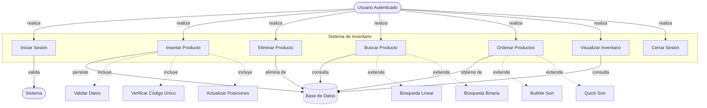
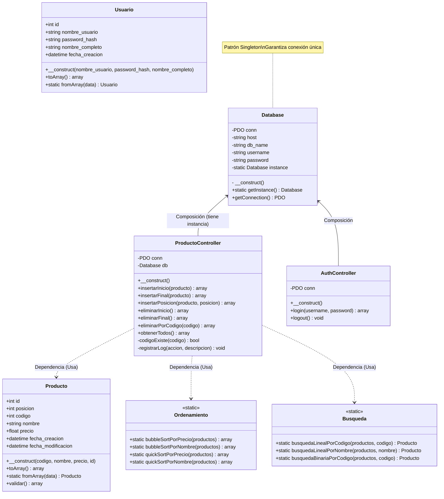

# 📐 Diseños y Explicación Técnica Avanzada del Sistema

Este documento contiene los tres diseños principales del sistema: Casos de Uso, Diagrama UML de Clases, y Diseño de Base de Datos, acompañados de una explicación técnica profunda y profesional orientada a desarrolladores senior y arquitectos de software.

---

## 1. Diagrama de Casos de Uso

### **Diagrama**



---

## 2. Diagrama UML de Clases y Análisis POO Profundo

### **Diagrama**



## . Diseño de Base de Datos 

### **Diagrama Entidad-Relación (ERD)**

```mermaid
erDiagram
    USUARIOS ||--o{ LOGS : "genera (1:N)"
    PRODUCTOS ||--o{ LOGS : "referencia (0:N)"
    
    USUARIOS {
        int id PK "Primary Key, Auto Increment"
        varchar(50) username UK "Unique Index"
        varchar(255) password_hash "Bcrypt Hash"
        varchar(100) nombre_completo
        timestamp fecha_creacion
    }
    
    PRODUCTOS {
        int id PK "Primary Key"
        int posicion "Index (Lista Enlazada)"
        int codigo UK "Unique Key (Negocio)"
        varchar(100) nombre "Index"
        decimal(10,2) precio "Index"
        timestamp fecha_creacion
    }
    
    LOGS {
        int id PK
        int usuario_id FK "Foreign Key (Usuarios)"
        varchar operacion
        text detalles "JSON/Texto Flexible"
        timestamp fecha "Index (Reportes)"
    }
```

### **Explicación Técnica para Profesionales de Base de Datos (DBA)**

Esta sección detalla las decisiones arquitectónicas de la base de datos, justificando cada elección desde una perspectiva de rendimiento, integridad y escalabilidad.

#### **1. Elección del Motor: InnoDB**
*   **Transaccionalidad (ACID)**: Es imperativo usar **InnoDB** y no MyISAM. Las operaciones de inserción en nuestra "lista enlazada simulada" requieren múltiples pasos SQL: primero un `UPDATE` masivo para desplazar posiciones, y luego el `INSERT` del nuevo registro.
    *   Si el `INSERT` falla después del `UPDATE`, los datos quedarían corruptos (huecos en la secuencia). Con InnoDB, envolvemos esto en una transacción (`START TRANSACTION` ... `COMMIT`/`ROLLBACK`) para garantizar atomicidad.
*   **Bloqueo a Nivel de Fila (Row-Level Locking)**: InnoDB permite que múltiples usuarios lean o inserten en diferentes filas simultáneamente sin bloquear toda la tabla, esencial para la concurrencia.

#### **2. Estrategia de Indexación Avanzada**
El esquema implementa índices estratégicos para optimizar cargas de trabajo mixtas (lectura/escritura):

*   **Clustered Index (PK `id`)**: Físicamente ordena los datos en disco. Inserciones secuenciales (por `AUTO_INCREMENT`) son muy eficientes y minimizan la fragmentación de páginas de datos.
*   **Unique Index (`codigo`)**:
    *   Funciona como una restricción de integridad de negocio.
    *   Permite búsquedas O(1) o O(log N) muy rápidas (`WHERE codigo = ?`).
*   **Secondary Indexes (`nombre`, `precio`, `posicion`, `fecha`)**:
    *   `idx_posicion`: **CRÍTICO**. El sistema ordena por defecto por `posicion`. Sin este índice, MySQL tendría que realizar un *Filesort* (ordenamiento costoso en memoria/disco) en cada consulta de listado. El índice permite recuperar las filas ya ordenadas.
    *   `idx_fecha` (en Logs): Optimiza la generación de reportes por rangos de fechas, una consulta común en auditoría.

#### **3. Integridad Referencial (Foreign Keys)**
*   **Relación `logs` -> `usuarios`**:
    *   Constraint: `FOREIGN KEY (usuario_id) REFERENCES usuarios(id)`.
    *   Acción `ON DELETE`: Se recomienda `RESTRICT` o `SET NULL`. Aquí usamos `SET NULL` (o mantener el ID si es solo historial) para que si un usuario se elimina, el log no desaparezca (auditoría), pero sabemos que el usuario ya no existe.
*   **Relación `logs` -> `productos`**:
    *   Constraint: `FOREIGN KEY (producto_id) REFERENCES productos(id)`.
    *   Acción `ON DELETE SET NULL`: Si se elimina un producto, el log persiste indicando "Producto eliminado", y el campo `producto_id` se pone en NULL para mantener la integridad referencia, mientras que los detalles del producto borrado quedan preservados en el campo de texto `detalles`.

#### **4. Normalización y Desnormalización Estratégica**
*   **3NF (Tercera Forma Normal)**:
    *   Las tablas `usuarios` y `productos` están en 3NF. Todos los atributos dependen de la clave primaria y no hay dependencias transitivas.
*   **Desnormalización Controlada (`logs.detalles`)**:
    *   El campo `detalles` en la tabla `logs` viola la 1NF si contiene JSON o estructuras complejas.
    *   **Justificación**: En auditoría, es preferible guardar una "snapshot" inmutable del estado del objeto en el momento del evento. Si normalizáramos los detalles en otra tabla, y luego cambiamos la estructura del producto, el histórico podría volverse inconsistente o difícil de reconstruir.

#### **5. Patrón "Lista Enlazada en SQL" (`posicion`)**
Este es el aspecto más sofisticado del diseño.
*   **Reto**: SQL no garantiza orden. Las bases de datos relacionales se basan en teoría de conjuntos (sin orden intrínseco).
*   **Solución**: Campo explícito `posicion`.
*   **Trade-off (Compromiso)**:
    *   **Lectura Rápida**: `SELECT * FROM productos ORDER BY posicion` es muy rápido con índices.
    *   **Escritura Costosa**: Insertar en `posicion=1` requiere actualizar N filas (`UPDATE productos SET posicion = posicion + 1`).
    *   **Justificación**: En la mayoría de aplicaciones, las lecturas superan a las escrituras 10 a 1 o más. Asumimos el costo de escritura para obtener lecturas ordenadas instantáneas y cumplir el requerimiento de "insertar al inicio/final".

---

